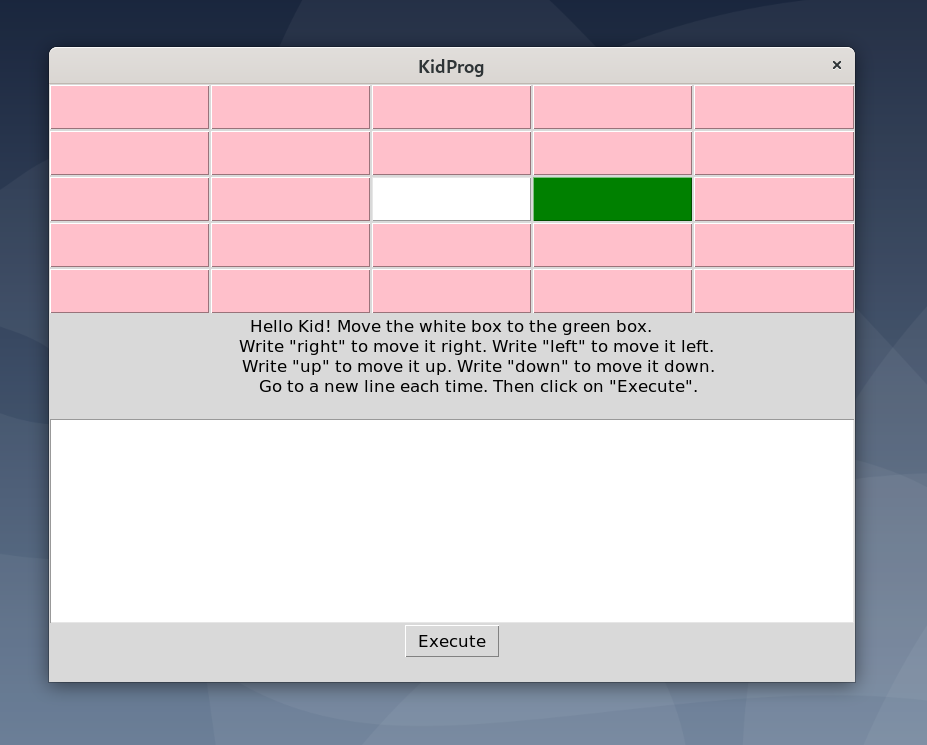
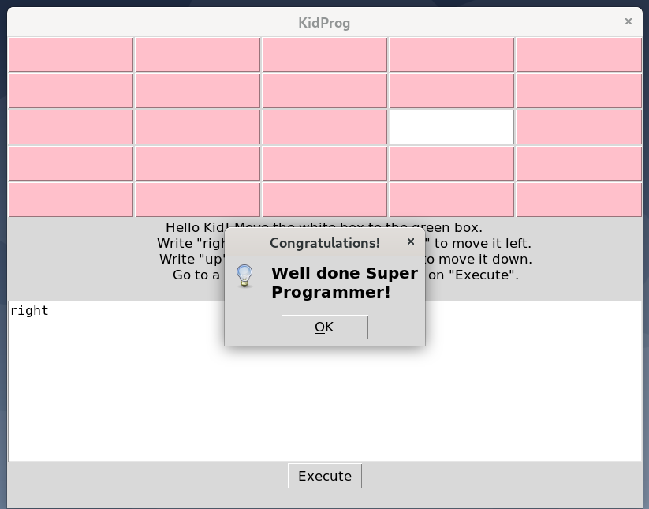
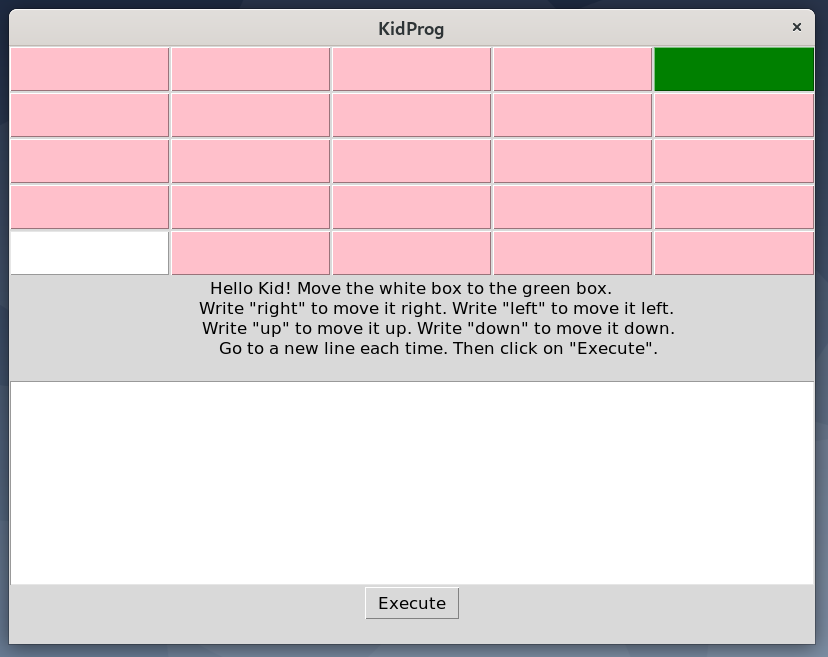
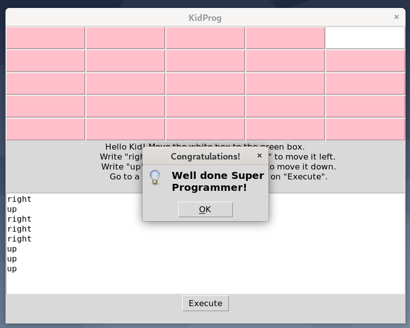

# Welcome to KidProg!

## Goal

This simple game teaches the fundamental of programming to kids:

1. Devise an algorithm
2. Implement it by using language syntax.
 
## Task

Move the white box to the green box by writing a code.
The syntax is made of four words: left, right, up and down.
Each non empty line should have only one word.

## ScreenShots

### Task 1

### Task 1 solved

### Task 2

### Task 2 solved

